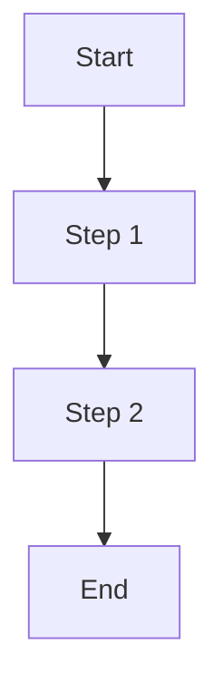
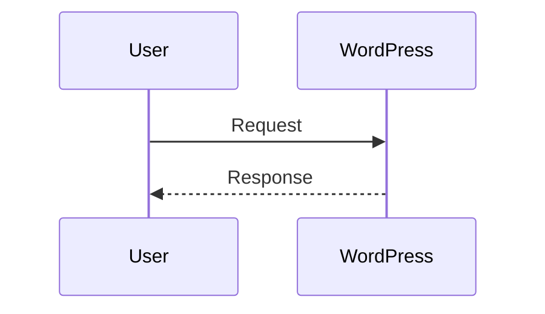
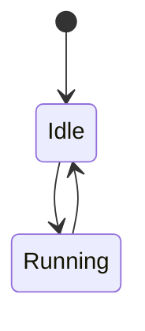
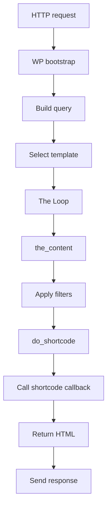

# Mermaid Diagram

When you need to express a system/process visually, produce a Mermaid diagram that is likely to render successfully in Mermaid v11+.

## When to Use

Use this skill when:
- The user asks to “vẽ diagram”, “draw a diagram”, “visualize”, “flow”, “sequence”, “state machine”, “ERD”, “architecture”.
- The user provides steps and wants a diagram representation.
- A Mermaid diagram fails to render and needs a compatibility fix.

## Inputs You Should Extract

- Diagram intent: flow vs sequence vs state vs ERD vs class
- Primary actors/nodes
- Direction: left-to-right vs top-to-bottom
- Branches/conditions
- Error paths and retries

If information is missing, prefer a reasonable default:
- Use `flowchart TD` for process flows
- Use `sequenceDiagram` for request/response flows

## Output Contract

- Output exactly one Mermaid code block unless the user explicitly asks for multiple.
- Use:
  - “short labels” in nodes
  - no HTML in labels
  - minimal punctuation
- If a renderer is known to be strict, keep labels alphanumeric and avoid quotes and parentheses in node text.

## “Render-Safe” Guidelines (Mermaid v11+)

### Prefer these patterns

- Node labels in the form: `A["Label words"]`
- Simple arrows: `A --> B`, `A -->|yes| B`
- Simple subgraphs:
  - `subgraph Name`
  - `end`

### Avoid these when a renderer fails

- HTML in labels (e.g., `<br/>`)
- Curly-brace decision nodes with long label text
- Complex punctuation in labels (`'`, `:`, `(`, `)`, `{`, `}`, `<`, `>`)

## Diagram Templates

### Flow (default)



### Sequence



### State



## Troubleshooting: Fix a Broken Mermaid Diagram

When the user reports “Syntax error in text”:
1. Remove HTML from labels.
2. Replace curly decision nodes with a normal node + labeled edges.
3. Simplify labels:
   - remove quotes and punctuation
   - shorten node text
4. Ensure node IDs are simple: `A`, `B`, `C1`, `Node_1`.
5. Keep only one diagram per code block.

## Examples

### Example: WordPress shortcode rendering flow



## How to Invoke

**Direct invocation:**
```
/mermaid-diagram
```
Then describe what you need, e.g.:
- "Draw a flowchart for shortcode rendering flow in WordPress"
- "Create a sequence diagram for the create product API endpoint"
- "Visualize the widget lifecycle states"

**Automatic invocation:** The agent will apply this skill when you ask to draw, visualize, or create diagrams.

