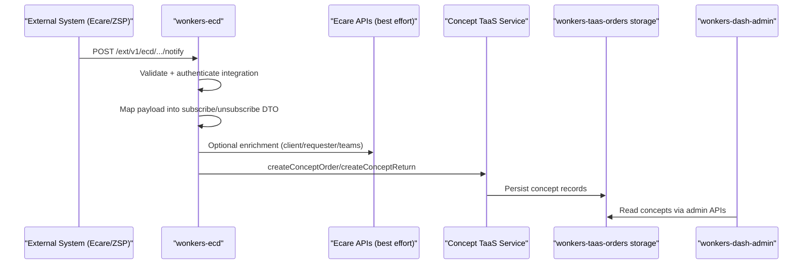

# [260228] Wonkers ECD Notification Flow

## 1. Purpose

`wonkers-ecd` is the inbound integration service for Ecare PUUR and ZSP notifications.

It does not render UI and it does not manage admin screens. Its job is:

1. Receive external webhook payloads.
2. Authenticate the integration user (Kong header).
3. Map raw `AdditionalFields` into typed TinyBots DTOs.
4. Enrich missing data (client, requester/returner, teams) with best-effort API calls.
5. Create concept order/return records through Concept TaaS services.

## 2. Public Endpoints

- `POST /ext/v1/ecd/puur/notify`
- `POST /ext/v1/ecd/zsp/notify`

Both routes are authenticated and body-validated in `src/App.ts`.

## 3. High-Level Sequence

## 4. Detailed Flow by Message Type

### 4.1 PUUR `Aanmeldbericht` (subscribe)

1. Controller authenticates integration.
2. `EcarePuurService.subscribe` maps notification to `SubscribeFields`.
3. Service tries to fetch Ecare auth headers.
4. If headers are available, service tries to enrich:
   - client
   - requester (if missing in form)
   - care teams
5. On enrichment failures, service keeps fallback defaults and continues.
6. Mapper builds:
   - structured concept order DTO
   - raw concept form (all `AdditionalFields`)
7. Service calls `createConceptOrder(form, orderDto)`.

### 4.2 PUUR `Afmeldbericht` (unsubscribe/return)

1. Controller authenticates integration.
2. `EcarePuurService.unsubscribe` maps notification to `UnsubscribeFields`.
3. Service tries to enrich client and returner if needed.
4. Mapper builds:
   - structured concept return DTO
   - raw concept form
5. Service calls `createConceptReturn(form, returnDto)`.

### 4.3 ZSP `Aanmeldbericht` and `Afmeldbericht`

ZSP flow is similar, but often reuses embedded `Patient` and `Employee` data directly from the incoming payload.

Result is still concept order/return creation through Concept services.

## 5. `returnReason` Handling

For return payloads, mapper reads these keys:

- `returnReason`
- `returnReasonMain`
- `returnReasonA`
- `returnReasonB`
- `returnReasonC`
- `returnReasonD`
- `returnReasonE`
- `returnReasonF`

Expected behavior:

1. Collect all matching non-empty values.
2. Join into a single comma-separated string.
3. Store as one `returnReason` field in concept return DTO.

Important:

- `notes` and `returnReason` are built from different sources.
- `notes` can look correct even when `returnReason` is incomplete.

## 6. Why This Matters for Dash Admin

`wonkers-dash-admin` does not call `wonkers-ecd` directly for order details.

Dashboard reads data from `wonkers-taas-orders` admin APIs.  
So if `returnReason` is incomplete in `wonkers-ecd` mapping, the same incomplete value is later shown in dashboard.

## 7. Service Boundaries

- `wonkers-ecd`: webhook intake + mapping + enrichment + concept creation trigger.
- `wonkers-taas-orders`: concept/order storage and admin query APIs.
- `wonkers-dash-admin`: presentation and admin actions.
- `wonkers-nedap`: separate pipeline for Nedap ONS retrieval (different ingestion path).

## 8. Troubleshooting Checklist

1. Confirm incoming webhook contains all expected `returnReason*` fields.
2. Check `wonkers-ecd` logs for mapping/enrichment warnings.
3. Verify concept return record in `wonkers-taas-orders`.
4. Compare stored `returnReason` with what dashboard shows.
5. If dashboard differs from storage, investigate frontend formatting.  
   If storage already misses values, investigate `wonkers-ecd` mapping.
