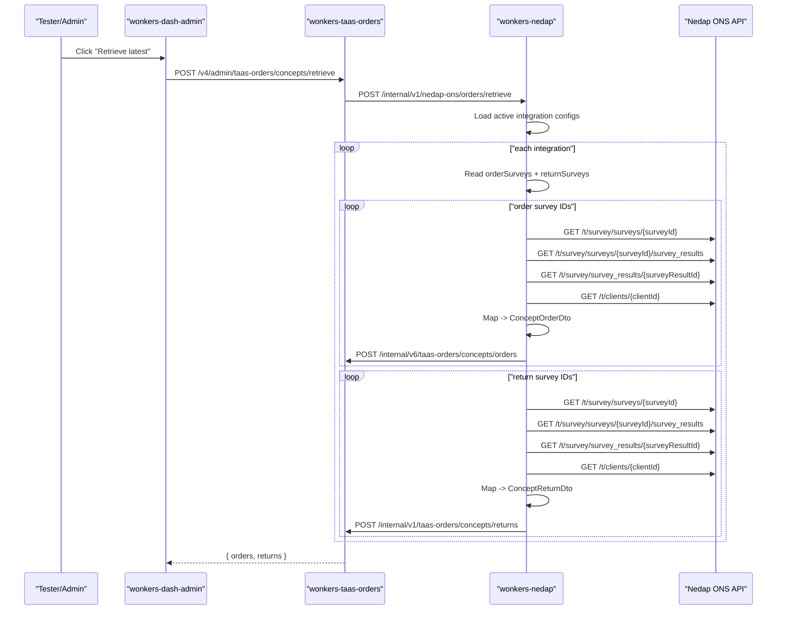
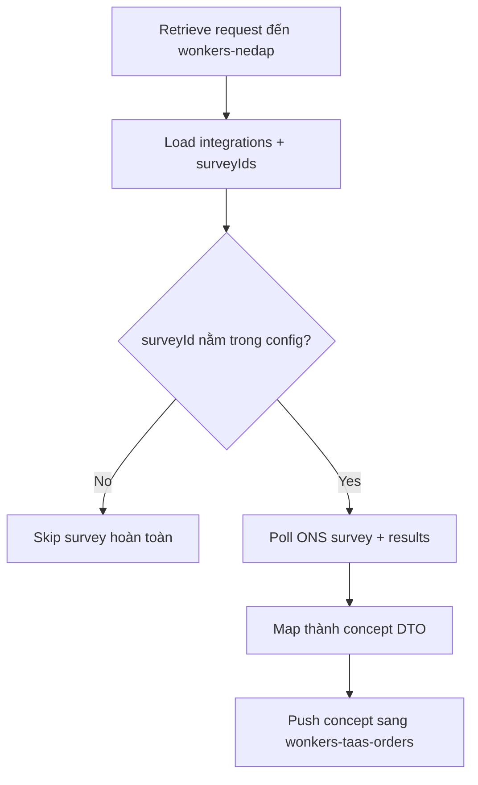

# 📘 [260213] - Nedap ONS Retrieve Concepts Flow (Order/Return)

## 1. Context

Tài liệu này mô tả end-to-end flow khi người dùng bấm **Retrieve latest** ở dashboard admin để đồng bộ concept từ Nedap ONS vào TinyBots.

Mục tiêu:

- Làm rõ vì sao form mới có thể "không chạy" dù ONS đã có dữ liệu.
- Làm rõ quan hệ giữa `orderSurveys` và `returnSurveys`.
- Liệt kê toàn bộ API tham gia theo đúng call chain thực tế trong code.

## 2. TL;DR cho case `4284` vs `552`

- `4284` là **order form mới**.
- `552` là **return form cũ đã linked**.
- `wonkers-nedap` chỉ poll các survey IDs nằm trong cấu hình integration (`surveyIds.orderSurveys`, `surveyIds.returnSurveys`).
- Nếu `4284` chưa nằm trong `orderSurveys`, hệ thống sẽ **không gọi ONS API cho survey 4284**, nên sẽ không có concept nào được tạo từ form đó.

Source code references:

- Lấy order theo `orderSurveys`: `workspaces/tinybots/backend/wonkers-nedap/src/service/SurveyService.ts:54`
- Lấy return theo `returnSurveys`: `workspaces/tinybots/backend/wonkers-nedap/src/service/SurveyService.ts:120`
- Model survey IDs: `workspaces/tinybots/backend/wonkers-nedap/src/model/Config/SurveyIds.ts:3`

## 3. Actors và Responsibilities

- `wonkers-dash-admin`:
  - Chỉ trigger action **Retrieve latest**.
  - Không chứa ONS survey form.
- `wonkers-taas-orders`:
  - Expose endpoint admin `/v4/admin/taas-orders/concepts/retrieve`.
  - Forward request sang `wonkers-nedap`.
- `wonkers-nedap`:
  - Đọc config integrations + survey IDs.
  - Pull dữ liệu từ Nedap ONS, map thành concept DTO.
  - Push concept sang `wonkers-taas-orders` internal endpoints.
- `Nedap ONS API`:
  - Nguồn survey/survey results/client/employee/address.

Source references:

- FE trigger: `workspaces/tinybots/frontend/wonkers-dash-admin/src/app/components/orders/overview/SpeedDial/OrderOverviewSpeedDial.tsx:29`
- FE endpoint config: `workspaces/tinybots/frontend/wonkers-dash-admin/src/app/common/utilities/constants/constants.module.ts:46`
- Admin retrieve endpoint (taas-orders): `workspaces/tinybots/backend/wonkers-taas-orders/src/App.ts:284`
- Forward sang wonkers-nedap: `workspaces/tinybots/backend/wonkers-taas-orders/src/service/NedapOnsService.ts:17`
- Retrieve endpoint (wonkers-nedap): `workspaces/tinybots/backend/wonkers-nedap/src/App.ts:154`

## 4. End-to-End Sequence

## 5. Logic Diagram (linked vs unlinked survey)

Implication:

- `4284` không nằm trong config => đi nhánh `Skip survey hoàn toàn`.
- `552` đã nằm trong config `returnSurveys` => đi nhánh poll/map/push bình thường.

## 6. APIs Used In Flow

### 6.1 Trigger APIs (UI -> Backend)

1. `POST /v4/admin/taas-orders/concepts/retrieve`

- Caller: `wonkers-dash-admin`
- Purpose: Trigger manual retrieval of concepts
- FE reference: `workspaces/tinybots/frontend/wonkers-dash-admin/src/app/components/orders/overview/redux/api.ts:24`
- Route reference: `workspaces/tinybots/backend/wonkers-taas-orders/src/App.ts:284`

1. `POST /internal/v1/nedap-ons/orders/retrieve`

- Caller: `wonkers-taas-orders` (`NedapOnsService`)
- Purpose: Delegate retrieve process to `wonkers-nedap`
- Service reference: `workspaces/tinybots/backend/wonkers-taas-orders/src/service/NedapOnsService.ts:17`
- Route reference: `workspaces/tinybots/backend/wonkers-nedap/src/App.ts:154`

### 6.2 Config APIs (source of linked survey IDs)

1. `GET /internal/v1/nedap-ons/configs`
2. `POST /internal/v1/nedap-ons/configs`
3. `GET /internal/v1/nedap-ons/configs/:configId`
4. `PATCH /internal/v1/nedap-ons/configs/:configId`
5. `DELETE /internal/v1/nedap-ons/configs/:configId`

Purpose:

- Quản lý danh sách survey IDs mà `wonkers-nedap` sẽ poll.

References:

- Route registration: `workspaces/tinybots/backend/wonkers-nedap/src/App.ts:179`
- Controller methods: `workspaces/tinybots/backend/wonkers-nedap/src/controller/InternalOnsConfigIntegrationController.ts:12`
- Insert/update config data: `workspaces/tinybots/backend/wonkers-nedap/src/service/OnsIntegrationConfigService.ts:12`
- Persist survey IDs into DB tables (`ons_order_survey`, `ons_return_survey`): `workspaces/tinybots/backend/wonkers-nedap/src/repository/OnsIntegrationConfigRepository.ts:146`

### 6.3 ONS External APIs (called by wonkers-nedap)

1. `GET /t/survey/surveys/{surveyId}`

- Purpose: Lấy survey definition
- Ref: `workspaces/tinybots/backend/wonkers-nedap/src/api/OnsNedapApi.ts:35`

1. `GET /t/survey/surveys/{surveyId}/survey_results?updated_since=YYYY-MM-DD`

- Purpose: Lấy list survey results theo surveyId
- Ref: `workspaces/tinybots/backend/wonkers-nedap/src/api/OnsNedapApi.ts:50`

1. `GET /t/survey/survey_results/{surveyResultId}`

- Purpose: Lấy full answers của từng result
- Ref: `workspaces/tinybots/backend/wonkers-nedap/src/api/OnsNedapApi.ts:82`

1. `GET /t/clients/{clientId}`

- Purpose: Lấy client metadata
- Ref: `workspaces/tinybots/backend/wonkers-nedap/src/api/OnsNedapApi.ts:149`

1. `GET /t/clients/{clientId}/main_address` (lazy address enrichment)

- Ref: `workspaces/tinybots/backend/wonkers-nedap/src/api/OnsNedapApi.ts:131`

1. `GET /t/employees/{employeeId}` (lazy requester enrichment)

- Ref: `workspaces/tinybots/backend/wonkers-nedap/src/api/OnsNedapApi.ts:97`

1. `GET /t/employees/{employeeId}/teams` (lazy team enrichment)

- Ref: `workspaces/tinybots/backend/wonkers-nedap/src/api/OnsNedapApi.ts:114`

### 6.4 Internal Push APIs (wonkers-nedap -> wonkers-taas-orders)

1. `POST /internal/v6/taas-orders/concepts/orders`

- Purpose: Create order concept
- Caller ref: `workspaces/tinybots/backend/wonkers-nedap/src/service/WonkersTaasOrderService.ts:20`
- Receiver route ref: `workspaces/tinybots/backend/wonkers-taas-orders/src/App.ts:544`

1. `POST /internal/v1/taas-orders/concepts/returns`

- Purpose: Create return concept
- Caller ref: `workspaces/tinybots/backend/wonkers-nedap/src/service/WonkersTaasOrderService.ts:31`
- Receiver route ref: `workspaces/tinybots/backend/wonkers-taas-orders/src/App.ts:291`

## 7. Survey Linking Model

`surveyIds` được định nghĩa gồm 2 mảng:

- `orderSurveys: number[]`
- `returnSurveys: number[]`

Ref: `workspaces/tinybots/backend/wonkers-nedap/src/model/Config/SurveyIds.ts:3`

Runtime behavior:

- Order retrieval chỉ dùng `orderSurveys`: `workspaces/tinybots/backend/wonkers-nedap/src/service/SurveyService.ts:54`
- Return retrieval chỉ dùng `returnSurveys`: `workspaces/tinybots/backend/wonkers-nedap/src/service/SurveyService.ts:120`

## 8. Manual vs Scheduled Retrieval

Có 2 cách chạy retrieval:

1. Manual trigger (từ UI admin)

- Flow như mục 4.

1. Cron job nội bộ của wonkers-nedap

- Mặc định mỗi 4 tiếng: `0 */4 * * *`
- Config ref: `workspaces/tinybots/backend/wonkers-nedap/config/default.json:30`
- Job function ref: `workspaces/tinybots/backend/wonkers-nedap/src/App.ts:273`

## 9. Debug Checklist cho tester/dev

1. Kiểm tra config hiện tại có chứa survey mới chưa

- `GET /internal/v1/nedap-ons/configs`

1. Nếu chưa có `4284`, update config để thêm vào `surveyIds.orderSurveys`

- `PATCH /internal/v1/nedap-ons/configs/:configId`

1. Trigger retrieval thủ công

- `POST /v4/admin/taas-orders/concepts/retrieve`

1. Đọc log `wonkers-nedap` để xác thực survey IDs thực sự được poll

- Log mẫu: `Survey ids: [...]` (được in tại `workspaces/tinybots/backend/wonkers-nedap/src/api/OnsNedapApi.ts:163`)

1. Xác nhận concept đã được tạo ở `wonkers-taas-orders`

- Query qua admin concepts endpoint:
  - `GET /v6/admin/taas-orders/concepts/orders`
  - `GET /v6/admin/taas-orders/concepts/returns`

## 10. Notes

- Hai frontend repos (`ui.r2d2`, `wonkers-dash-admin`) không chứa ONS form để điền `useClientAddress`.
- ONS form là external system; TinyBots chỉ poll dữ liệu qua API từ ONS.
